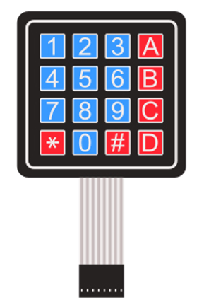
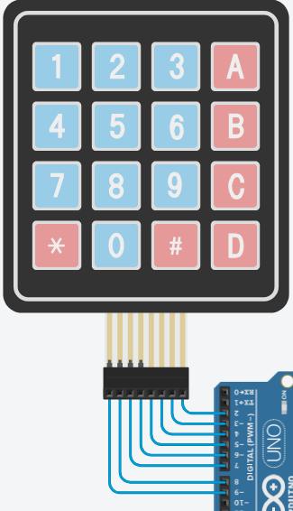

## Cos'è un Keypad?



Un tastierino a matrice (come quello dei bancomat o degli allarmi di casa) è semplicemente un insieme di normalissimi pulsanti racchiusi in un unico modulo. 

I modelli più comuni sono il **4x4** (16 tasti, inclusi A, B, C, D) e il **4x3** (12 tasti, tipico dei vecchi telefoni). 

Con questi componenti c'è però un grosso problema di pin: se ogni bottone avesse il suo piedino indipendente, servirebbero 16 pin per leggerli tutti! Quindi, qual è la soluzione? I bottoni del Keypad sono collegati a **griglia**, disposti su righe e colonne.

---

## Come funziona la Griglia di Pulsanti

Sotto ogni tasto di gomma c'è un interruttore aperto. Quando premi un bottone (es. il numero "5"), non fai altro che **chiudere un circuito collegando fisicamente una Riga con una Colonna** (in questo caso, Riga 2 e Colonna 2). 

Ma come fa Arduino a capire *quale* incrocio hai chiuso, visto che i fili sono tutti in comune? 

Immagina il funzionamento come il gioco della **Battaglia Navale**. Arduino esegue un controllo velocissimo, accendendo una riga alla volta per vedere se la corrente torna indietro da qualche colonna.

Ecco cosa succede al rallentatore quando decidi di premere il numero **"6"** (che si trova all'incrocio tra Riga 2 e Colonna 3):

1. **Scansione Riga 1:** Arduino invia corrente (5V) *solo* alla Riga 1 e "ascolta" tutte e quattro le colonne. Il tasto "6" non è qui, quindi il circuito è aperto. La corrente non passa. Arduino spegne la Riga 1 e passa oltre.
2. **Scansione Riga 2 (Il contatto):** Arduino accende la Riga 2. Dato che il tuo dito sta premendo il "6", hai creato un "ponte" fisico tra la Riga 2 e la Colonna 3.
3. **Il Ritorno del Segnale:** La corrente viaggia sulla Riga 2, attraversa il ponte che hai creato premendo il tasto, e scende lungo la Colonna 3 tornando ai pin di Arduino in ascolto.
4. **Il Calcolo:** Arduino a questo punto incrocia i dati: *"Ho mandato corrente sulla Riga 2 e l'ho vista tornare dalla Colonna 3. L'unico tasto a queste coordinate è il 6!"*.

Tutto questo processo si ripete per tutte le righe decine di volte al secondo.

### Prova il simulatore
Per vedere questo meccanismo in azione, **clicca e tieni premuto** (senza rilasciare il mouse) uno dei pulsanti nella griglia qui sotto. 
Vedrai la scansione di Arduino scorrere in giallo e, quando incrocerà la riga del tasto che stai premendo, il segnale in verde va sulla colonna corretta chiudendo il circuito.

<iframe src="/appunti-sta/keypad_simulator.html" style="display: block; margin: 16px auto; width: 100%; max-width: 400px; height: 300px; border: 1px solid #ccc; border-radius: 8px;"></iframe>

:::note[Tinkercad vs Realtà]
I tastierini su Tinkercad funzionano in modo **identico** a quelli reali. Il codice e i collegamenti che sperimentiamo nel simulatore non cambiano quando passiamo al componente fisico sulla breadboard.
:::

---

## Collegamento

Il tastierino 4x4 ha **8 piedini**. Da sinistra verso destra, generalmente rappresentano:
* Pin 1, 2, 3, 4: **Righe** (R1, R2, R3, R4)
* Pin 5, 6, 7, 8: **Colonne** (C1, C2, C3, C4)

Vanno collegati direttamente a 8 pin digitali qualsiasi di Arduino (es. dal pin 9 al pin 2).
Nella seguente immagine viene mostrato il metodo più comodo per collegare il Keypad, che verrà utilizzato anche nel codice più avanti.



Non servono resistenze esterne: la libreria che useremo attiva automaticamente le resistenze di pull-up interne presenti nel microcontrollore di Arduino permettendoci quindi di collegare meno cose.

---

## Codice

Scrivere a mano il codice di scansione di righe e colonne è lungo e prono a errori (bisognerebbe gestire anche il "*debouncing*" dei vari bottoni del Keypad). Fortunatamente, esiste la libreria ufficiale `<Keypad.h>`.

**Ma cos'è esattamente una libreria?**
In programmazione, una libreria è una raccolta di codice già scritto, testato e messo a disposizione dalla community di sviluppatori. Immaginala come un manuale aggiuntivo che insegna ad Arduino comandi che prima non conosceva. Invece di dover **reinventare la ruota** e programmare da zero tutta la logica della "battaglia navale" e dei ritardi di lettura, la libreria fa tutto il lavoro sporco dietro le quinte.

:::tip[Aggiungere la libreria]
- **Su Tinkercad:** Clicca sul tasto "Librerie" (icona del cassetto) e cerca "Keypad", poi clicca "Includi".
- **Sull'IDE di Arduino:** Vai su *Sketch > Includi libreria > Gestione librerie* e cerca "Keypad" (quella di Mark Stanley, Alexander Brevig).
:::

### Inizializzazione

Prima del `setup()`, dobbiamo "spiegare" alla libreria com'è fatto il nostro tastierino, quanti tasti ha e a quali pin lo abbiamo collegato:

```cpp
#include <Keypad.h>

const byte ROWS = 4; // Quattro righe
const byte COLS = 4; // Quattro colonne

// Mappiamo i tasti per come appaiono fisicamente
// utilizzando una matrice
char keys[ROWS][COLS] = {
  {'1','2','3','A'},
  {'4','5','6','B'},
  {'7','8','9','C'},
  {'*','0','#','D'}
};

// Indichiamo i pin di Arduino a cui abbiamo collegato le righe e le colonne
byte rowPins[ROWS] = {9, 8, 7, 6}; // R1, R2, R3, R4
byte colPins[COLS] = {5, 4, 3, 2}; // C1, C2, C3, C4

// Creiamo l'oggetto "tastierino" passando tutte le informazioni
Keypad tastierino = Keypad(makeKeymap(keys), rowPins, colPins, ROWS, COLS);
```
Precedentemente abbiamo visto le costanti tramite `#define`; in questo caso utilizziamo invece `const`. Per ora, è importante sapere solamente che grazie a `const` possiamo definire delle costanti con anche il tipo di variabile specificato, cosa non possibile con `#define`. Per poter utilizzare la libreria del **Keypad**, dobbiamo creare dei valori `byte`, non `int`. Perché? Perché chi ha scritto la libreria ha deciso così.

Con l'ultima riga di codice, grazie alla libreria, andiamo a creare una variabile di tipo `Keypad`, che è di fatto un tipo custom fornito dalla libreria stessa.

### Setup e Loop

Il resto del codice è sorprendentemente semplice. Basta chiedere al tastierino se un tasto è stato premuto usando la funzione `getKey()`.

```cpp
void setup() {
  Serial.begin(9600); // Inizializziamo il Monitor Seriale per vedere i risultati
  Serial.println("Premi un tasto...");
}

void loop() {
  // Legge il tasto premuto. Se nessun tasto è premuto, restituisce NO_KEY (null)
  char tastoPremuto = tastierino.getKey();

  // Se la variabile contiene effettivamente un carattere...
  if (tastoPremuto) {
    Serial.print("Hai premuto: ");
    Serial.println(tastoPremuto);
    
    // Esempio: eseguire un'azione specifica per un tasto
    if (tastoPremuto == '*') {
      Serial.println("Azione: Reset sistema!");
    }
  }
}
```

### Esempio Completo

```cpp
#include <Keypad.h>

#define int ROWS 4 // Quattro righe
#define int COLS 4 // Quattro colonne

// Mappiamo i tasti per come appaiono fisicamente
// utilizzando una matrice
char keys[ROWS][COLS] = {
  {'1','2','3','A'},
  {'4','5','6','B'},
  {'7','8','9','C'},
  {'*','0','#','D'}
};

// Indichiamo i pin di Arduino a cui abbiamo collegato le righe e le colonne
int rowPins[ROWS] = {9, 8, 7, 6}; // R1, R2, R3, R4
int colPins[COLS] = {5, 4, 3, 2}; // C1, C2, C3, C4

// Creiamo l'oggetto "tastierino" passando tutte le informazioni
Keypad tastierino = Keypad(makeKeymap(keys), rowPins, colPins, ROWS, COLS);

void setup() {
  Serial.begin(9600); // Inizializziamo il Monitor Seriale per vedere i risultati
  Serial.println("Premi un tasto...");
}

void loop() {
  // Legge il tasto premuto. Se nessun tasto è premuto, restituisce NO_KEY (null)
  char tastoPremuto = tastierino.getKey();

  // Se la variabile contiene effettivamente un carattere...
  if (tastoPremuto) {
    Serial.print("Hai premuto: ");
    Serial.println(tastoPremuto);
    
    // Esempio: eseguire un'azione specifica per un tasto
    if (tastoPremuto == '*') {
      Serial.println("Azione: Reset sistema!");
    }
  }
}
```