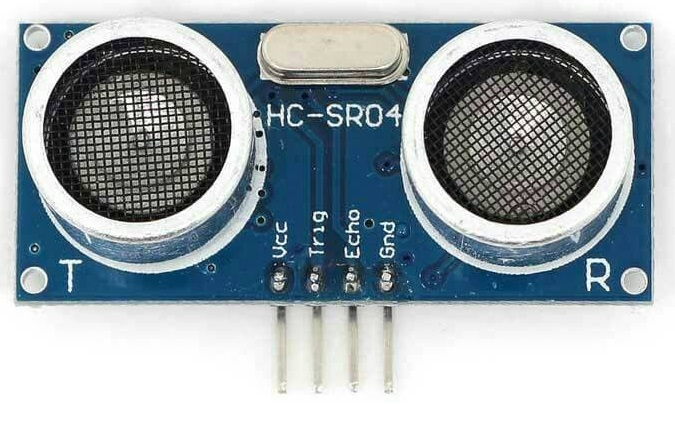

## Cos'è il Sensore a Ultrasuoni?



L'**HC-SR04** è un sensore che misura la **distanza** tra sé stesso e un ostacolo davanti a lui. Lo si riconosce facilmente dai due "occhi" circolari frontali: uno emette un impulso sonoro ad alta frequenza (ultrasuoni, non udibili dall'uomo), l'altro lo riceve dopo che è rimbalzato sull'ostacolo.

Conoscendo la velocità del suono e il tempo impiegato dall'impulso per andare e tornare, Arduino calcola la distanza.

---

## Collegamento

Il sensore ha **4 pin**, chiaramente etichettati sulla scheda:

| Pin | Collegamento |
|:---:|:---|
| **VCC** | 5V di Arduino |
| **TRIG** | Pin digitale OUTPUT (es. pin 8) |
| **ECHO** | Pin digitale INPUT (es. pin 12) |
| **GND** | GND di Arduino |

```cpp
#define TRIG_PIN 8
#define ECHO_PIN 12
```

Nel `setup()`, i due pin vanno configurati con `pinMode()`:

```cpp
void setup() {
  pinMode(TRIG_PIN, OUTPUT);
  pinMode(ECHO_PIN, INPUT);
}
```

---

## Come Funziona

Il sensore lavora in tre fasi, che vanno eseguite in sequenza ogni volta che si vuole una lettura:

**1. Resetta il trigger**: si porta il pin TRIG a LOW per assicurarsi che sia pulito prima dell'impulso:
```cpp
digitalWrite(TRIG_PIN, LOW);
```

**2. Invia l'impulso**: si porta TRIG a HIGH per esattamente **10 microsecondi**, poi si abbassa di nuovo. Questo fa partire l'onda sonora:
```cpp
digitalWrite(TRIG_PIN, HIGH);
delayMicroseconds(10);
digitalWrite(TRIG_PIN, LOW);
```

**3. Misura il tempo di ritorno**: la funzione `pulseIn()` aspetta che il pin ECHO vada HIGH e misura per quanti microsecondi rimane alto, cioè il tempo che l'onda ha impiegato per andare e tornare:
```cpp
long durata = pulseIn(ECHO_PIN, HIGH);
```

:::note[`delayMicroseconds()` vs `delay()`]
`delayMicroseconds()` funziona come `delay()` ma lavora in **microsecondi** invece che millisecondi. È necessario qui perché l'impulso deve durare esattamente 10µs, che è un valore troppo piccolo per `delay()` che lavora in millisecondi.
:::

---

## Calcolare la Distanza

Il valore restituito da `pulseIn()` è il tempo in microsecondi. Per convertirlo in centimetri si applica questa formula:

```
Distanza (cm) = 0.034 × durata / 2
```

Il **0.034** è la velocità del suono in cm/µs. Si **divide per 2** perché il suono percorre il tragitto due volte: andata verso l'ostacolo e ritorno verso il sensore.

In codice:

```cpp
long durata = pulseIn(ECHO_PIN, HIGH);
long distanza = 0.034 * durata / 2;
```

:::note[Perché `long` e non `int`?]
I valori di `pulseIn()` e di `durata` possono diventare numeri molto grandi (l'attesa massima è di 1 secondo = 1.000.000 µs). Un `int` non basterebbe a contenerli, quindi si usa `long`.
:::

---

## Esempio Completo

```cpp
#define TRIG_PIN 8
#define ECHO_PIN 12

void setup() {
  Serial.begin(9600);
  pinMode(TRIG_PIN, OUTPUT);
  pinMode(ECHO_PIN, INPUT);
}

void loop() {
  long distanza = leggiDistanza();

  Serial.print("Distanza: ");
  Serial.print(distanza);
  Serial.println(" cm");

  delay(500);
}

long leggiDistanza() {
  digitalWrite(TRIG_PIN, LOW);
  digitalWrite(TRIG_PIN, HIGH);
  delayMicroseconds(10);
  digitalWrite(TRIG_PIN, LOW);

  long durata = pulseIn(ECHO_PIN, HIGH);
  return 0.034 * durata / 2;
}
```

La sequenza di lettura è raccolta in una funzione dedicata `leggiDistanza()` che restituisce direttamente la distanza in cm, così il `loop()` rimane pulito e la logica del sensore è in un posto solo.